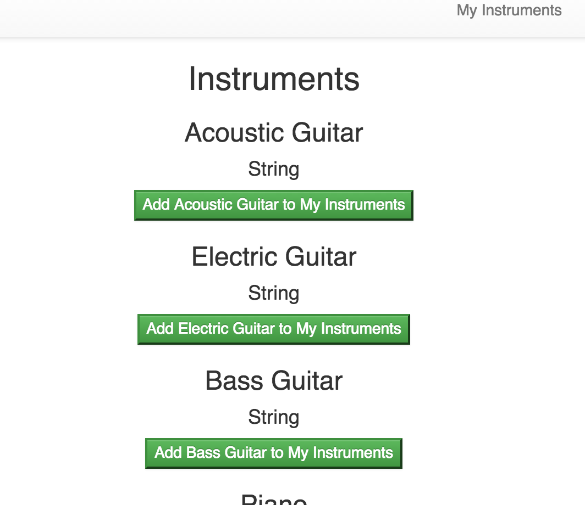

# Voucher

Voucher is currently an app that lets you choose from a list of instruments to add to your personal list of instruments. Coming soon will be the ability to endorse or vouch for another person's ability to play each individual instrument. Stay tuned!

## Motivation

I wanted to make this app because I think the endorsement system of linked in is really cool and there isn't really a good social media site for musicians. In theory I would eventually like users to be able to search for other users by instrument and location so that you could find someone nearby and know what kind of instruments they play and how many people have endorsed them for that instrument.

## Dependencies

Enter

```sh
npm install && bower install
```

from the terminal to install dependencies

## Image of App



## Technologies

For the front end I used HTML, CSS, and Javascript. I also used Ember as a framework to help with building the app.

I wrote the back end with Ruby and used Rails as a framework. For a database I used PostgreSQL.

## Deployed Front End

https://jordanallain.github.io/voucher

## Back End Repo

https://github.com/jordanallain/voucher-backend

## Deployed Back End

https://rocky-falls-32123.herokuapp.com/

## User Stories

- As a user I want a musician specific social media site
- As a user I want to be able to list the instruments I play
- As a user I want to be able to look for other users
- As an admin I want users to only be able to +1 other users' instrumental abilities
- As an admin I want users to be able to search for other users by whichever field they would like

## Wireframes

https://wireframe.cc/RuuDHI Landing Page

https://wireframe.cc/C0moej User Profile

https://wireframe.cc/Bp6b6L Search Users Results

## ERD

In my app I will have a users table for anyone that signs up. I will also have a table of instruments. Users and Instruments will have a many to many relationship so that each user can choose the same instrument to display in the list of ones that they play.

## Problems

Working with Ember proved to be extremely difficult but it was awesome to be able to feel some of its power as I became more familiar with it. If I were to approach another Ember app I would start with breaking things down into the smallest components they could be so I could reuse them if I wanted to. I started out without using components and it was more difficult to break things down after they were structured than if I had just started out using components to begin with.

## [License](LICENSE)

1.  All content is licensed under a CC­BY­NC­SA 4.0 license.
1.  All software code is licensed under GNU GPLv3. For commercial use or
    alternative licensing, please contact legal@ga.co.
